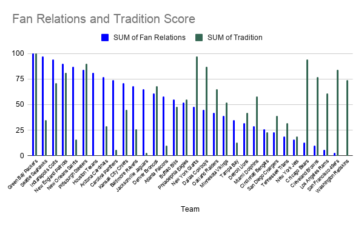
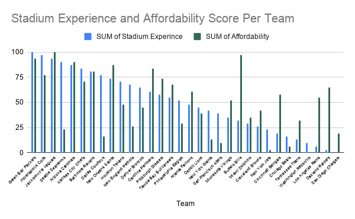
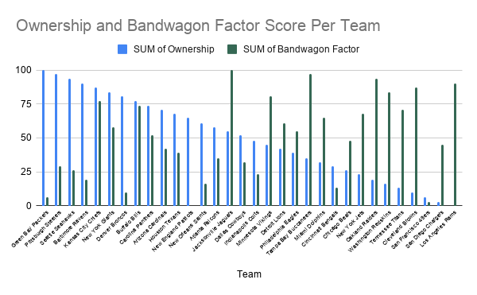

# Tired of disapointment from your NFL team? Here is an algorithm to find your new one

After Blythe Terrell, editor for FiveThirtyEight claimed the Los Angeles Rams were "dead to her," she created an algorithm using 3,352 questions to find her new team, and you can too. With categories including, fan relation, the bandgwagon factor, and tradition, Terrell scored what categories mean most to her, and used those ratings to find her new favorite team. 

## Dataset Information

The dataset used in this story was downloaded through github, from the news website FiveThirtyEight that uses data to report on topics ranging from politics to sports. Through looking further into the dataset and the source, FiveThirtyEight is a reliable news source, that is most known for their ability to predict election results. Furthermore, the creator of the dataset, Blythe Terrel, is the senior editor for science and health, with experience in data anaylsis and collection. The source has a political agenda, however it does not pertain to this dataset, and remains a trusted source. 

## Data Analysis 

### Fan Relations and Traditions 

I was interested to see if the courtesy by players, coaches and front offices towrd fan, has any relation to the championships/division titels/wins in the team's entire history. I found that there is no significant relationship between the fan relation sscore and tradition score for each team. My hypothesis was that teams with higher fan relations would have a higher tradition score, however, this is not necessarily true. The 4 teams with the lowest fan relations have some of the highest scores for tradition, but there is no signficant relationship.

 

### Stadium Experience and Affordability 

I was interested to see if the quality of venue; fan friendliness of environment; frequency of game-day promotions has any relation to the price of tickets, parking, and concessions at the stadiums of each team. I found that there is no relationship between between stadium experience and affordability. However, I found it interesting that the stadiums with the highest scores for stadium experience have some of the highest affordability. I hypothesized that the stadiums with the best expeince would be less affordable, with higher ticket prices for a higher qaulity stadium, however, this is not the case. 

### Ownership and the Bandwagon Factor 

I was curious if loyalty to core players and the community has any relation to whether each team's next 5 years are likely to be better than their previous 5. I found that teams with lower ownership scores have higher bandwagon factor scores. My hypothesis was correct the fans who are loyal to core players would be less likely to be a bandwagon, as they would be fasn regalrdless if the team is projected to do well in the next 5 years. It is also interesting to see what teams have a high bandwagon factor scores, as player changes during the year of the data caused these teams to have more spotlight on them. 

## Summary

There are very few ethical concerns, as this data is not targeting specific people, and it is not releasing any data that is personal. There there is possible bias in this alrgorithm, however, becasue the creator added categories such as, "Proximity to New York" and "Proximity to St. Louis", when the person using this alrgorithm may not live near those places. However, the importance of each category can be ranked to the individual, which lessens the chance that this biases the result. Furthermore, some categores are subjective, such as stylishness of uniform, coaching strength, and likeability of players, therefore allowing results that may not be necessary accurate for each person. 

To continue this story, the results for others who used the test can be reported on, asking if the those who took it found it accurate, and whether they agree with their results. The importance of each category can also be discussed through interviews with those who used the algorythm. Their stories can be followed on why they chose to take this test, as Terrell created found this data after her distaste with Rams. 
